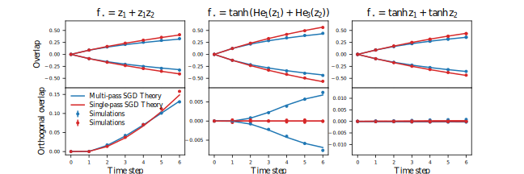

# The Benefits of Reusing Batch for Gradient Descent in Two-Layer Networks: Breaking the Curse of Information and Leap Exponents

    

    
<i>
    Comparison of one-pass SGD with multi-pass SGD for different targets. The multi-pass SGD is able to learn a wider class of functions, including some with high information(leap) exponent.
    </i>

### Structure
This repository contains the following code:
 - `dmft.py`: our implementation of DMFT for committee machines;
 - `simulations.py`: simulate the processes to be compared with DMFT;
 - `result.ipynb`: show the results of the simulations and DMFT;
